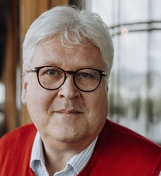
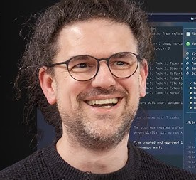
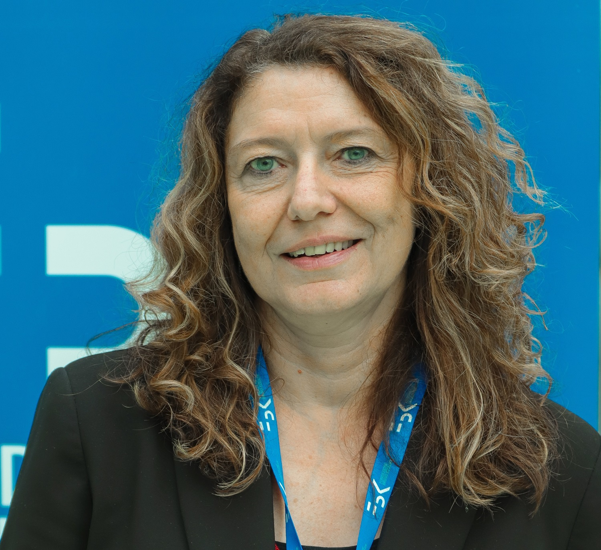
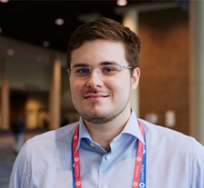
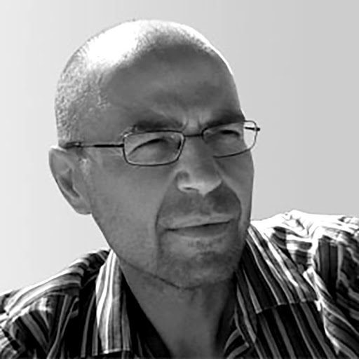
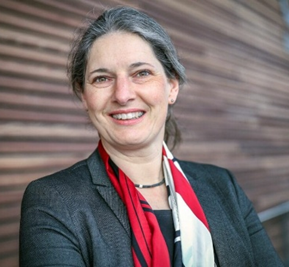

# Bilateral AI Workshop @ NeurIPS 2026
## Agentic Systems as Neuro-Symbolic Integration -- A NeurIPS Europe Workshop Proposal

**Every LLM agent is a neuro-symbolic system: a neural network model inside a symbolic harness. Bridging three communities that need each other.**

📍 Paris · 🗓️ December 12/13 · 

---

## Abstract

Modern agentic AI systems consist of a **sub-symbolic large language model** paired with a **symbolic harness** that parses outputs, dispatches tools, and enforces control flow, which makes every deployed agent an instance of **bilateral AI**: the deliberate integration of sub-symbolic learning with symbolic representation and reasoning to enable agentic capacities. Current agents nonetheless lose their goals across long tool-call sequences, fail to recognise when a task is complete, coordinate poorly with one another, and fail surprisingly on simple problems. These failures sit in bookkeeping, compositional planning, and reuse rather than in perception. Decades of work in neuro-symbolic AI and knowledge representation on data efficiency, adaptiveness, state-tracking, and hierarchical memory bear directly on these gaps, but currently reach agentic AI systms only by accident. This proposal considers agentic AI as neuro-symbolic systems, and treats the harness as a research object rather than infrastructure. .

The workshop brings together three communities that meet only occasionally:

1. classical neuro-symbolic AI and knowledge representation,
2. LLM agents and tool use,
3. the benchmarking community focused on rigorous evaluation of LLMs and agentic AI.

---

## Speakers

<table>
  <tr>
    <td width="150">
      
    </td>
    <td>
      <h3><a href="https://en.wikipedia.org/wiki/Sepp_Hochreiter">Sepp Hochreiter</a></h3>
      
Inventor of the LSTM and pioneer of modern deep learning.

    </td>
  </tr>
  <tr>
    <td width="150">
      
    </td>
    <td>
      <h3><a href="https://www.cs.ox.ac.uk/people/marta.kwiatkowska/">Marta Kwiatkowska</a></h3>
      
Leading voice on formal verification, probabilistic systems, and trustworthy AI.

    </td>
  </tr>
  <tr>
    <td width="150">
      
    </td>
    <td>
      <h3><a href="https://mariozechner.at/">Mario Zechner</a></h3>
      
Builder of the harness Pi and sharp thinker on how coding agents should be wired.

    </td>
  </tr>
  <tr>
    <td width="150">
      
    </td>
    <td>
      <h3><a href="https://www.unibo.it/sitoweb/michela.milano/en">Michela Milano</a></h3>
      
Pioneer in combining machine learning with constraint-based reasoning.

    </td>
  </tr>
  <tr>
    <td width="150">
      
    </td>
    <td>
      <h3><a href="https://petar-v.com/">Petar Veličković</a></h3>
      
Foundational graph neural networks researcher aligning neural models with algorithms.

    </td>
  </tr>
  <tr>
    <td width="150">
      
    </td>
    <td>
      <h3><a href="https://ellis.eu/person/marco-gori">Marco Gori</a></h3>
      
Graph neural networks pioneer linking learning with structured representations.

    </td>
  </tr>
  <tr>
    <td width="150">
      
    </td>
    <td>
      <h3><a href="https://ekvv.uni-bielefeld.de/pers_publ/publ/PersonDetail.jsp?personId=18302458">Barbara Hammer</a></h3>
      
Expert in explainable, trustworthy learning for changing and structured data.

    </td>
  </tr>
</table>

---

## Organizers

**[Karolina Drożdż](https://pl.linkedin.com/in/karolina-dro%C5%BCd%C5%BC)**, *IDEAS Warsaw & ELLIS Unit Warsaw*  
**[Kristian Kersting](https://ml-research.github.io/people/kkersting/)**, *TU Darmstadt & ELLIS Unit Darmstadt*  
**[Günter Klambauer](https://www.jku.at/en/institute-for-machine-learning/about-us/team/univ-prof-mag-dr-guenter-klambauer/)**, *JKU Linz & ELLIS Unit Linz*  
**[Robert Legenstein](https://www.tugraz.at/institute/iml/people/prof-legenstein)**, *TU Graz & ELLIS Unit Graz*  
**[Mena Leemhuis](https://menaleemhuis.github.io/)**, *JKU Linz*  
**[Francesca Toni](https://www.doc.ic.ac.uk/~ft/)**, *Imperial College London*  

---

## Preliminary Schedule

| Time          | Duration | Session                                                                                                                                  |
|---------------|----------|------------------------------------------------------------------------------------------------------------------------------------------|
| 9:00 – 9:10   | 10 min   | **Opening remarks**                                                                                                                       |
| 9:10 – 10:20  | 70 min   | **Block 1**: 2 invited talks (20 min each) + 1 contributed talk (10 min) + **30 min discussion** |
| 10:20 – 10:50 | 30 min   | ☕ **Morning coffee break & posters on display**                                                                                          |
| 10:50 – 12:00 | 70 min   | **Block 2**: 2 invited (20 min) + 1 contributed (10 min) + **30 min discussion**                                  |
| 12:00 – 13:00 | 60 min   | 🍽️ **Lunch break & posters on display**                                                                                                  |
| 13:00 – 14:10 | 70 min   | **Block 3**: 2 invited (20 min) + 1 contributed (10 min) + **30 min discussion**                        |
| 14:10 – 15:10 | 60 min   | **Block 4**: 1 invited (20 min) + 1 best-paper talk (15 min) + 1 contributed (10 min) + **15 min discussion** |
| 15:10 – 15:40 | 30 min   | ☕ **Afternoon coffee break & posters on display**                                                                                        |
| 15:40 – 16:40 | 60 min   | 🎙️ **Cross-community panel**                                                           |
| 16:40 – 17:50 | 70 min   | 🖼️ **Dedicated poster session**                                                                                                          |
| 17:50 – 18:00 | 10 min   | **Closing remarks & best-paper award**                                                                                                    |

## Supporters
The workshop proposal is supported by the [ELLIS program Semantic, Symbolic and Interpretable Machine Learning](https://ellis.eu/research/programs/semantic-symbolic-and-interpretable-machine-learning), by [Austria's AI Excellence Cluster](https://www.bilateral-ai.net/), the [ELLIS unit Linz](https://ellis.eu/research/sites/unit-linz),the [ELLIS unit Vienna](https://ellis.eu/research/sites/unit-vienna),  [ELLIS unit Warsaw](https://ellis.eu/research/sites/unit-warsaw), and the [ELLIS unit Graz](https://ellis.eu/research/sites/unit-graz).

## Contact

klambauer@ml.jku.at
